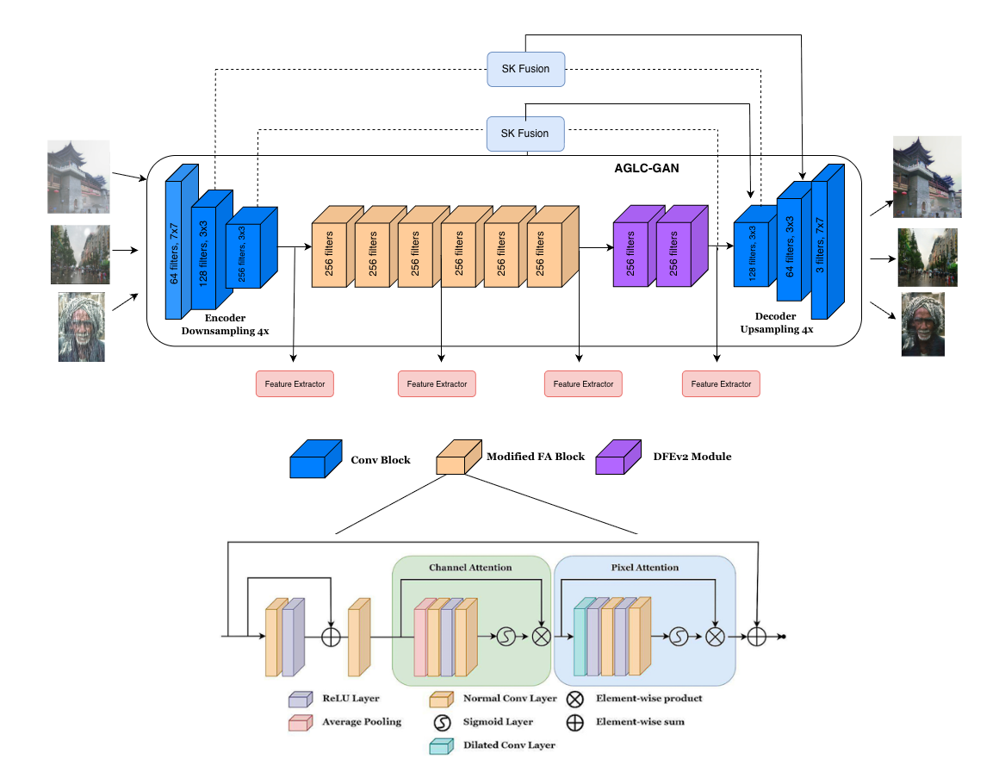

# Continual Learning-Based Unified Model for Unpaired Image Restoration Tasks

This page contains the code related to the paper: [Continual Learning-Based Unified Model for Unpaired Image Restoration Tasks]

## Abstract
Restoration of images contaminated by different adverse weather conditions such as fog, snow, blurr and rain is a challenging task due to the varying nature of the weather conditions. Most of the existing methods focus on any one particular weather conditions. However, for applications such as autonomous driving, a unified model is necessary to perform restoration of corrupted images due to different weather conditions. We propose a continual learning approach to propose a unified framework for image restoration. The proposed frame-work proposes three key innovations ideas: (1) Selective Kernel Fusion layers that dynamically combine global and local features for robust adaptive feature selection and bidirectional training of a cycleGAN backbone; (2) Elastic Weight Consolidation (EWC) to enable continual learning and mitigate catastrophic forgetting across multiple restoration tasks; and (3) a novel Cycle-Contrastive Loss that enhances feature discrimination while preserving semantic consistency during training across domains. We propose an unpaired image restoration approach to reduce the bias of the proposed approach towards the training data. Extensive experiments on benchmark datasets for dehazing, desnowing, deraining, and deblurring tasks demonstrate significant improvements in PSNR, SSIM, and perceptual quality over the state-of-the-art

The Generator architecture is:

